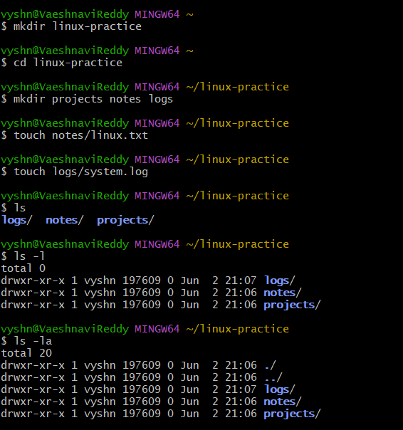
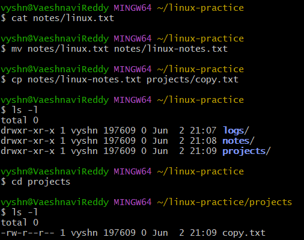
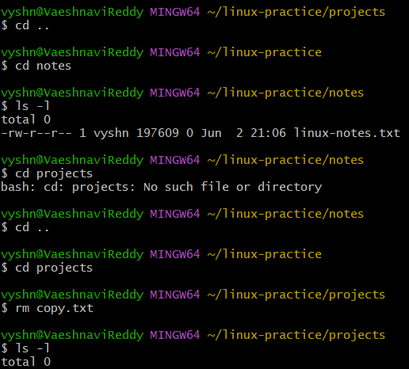

# Linux File Management Lab

## Objective

Practice Linux navigation and file management commands.

## Commands Used

pwd
ls
cd
mkdir
touch
cp
mv
rm
cat

## Lab Steps

1. Created linux-practice directory.
2. Created projects, notes, and logs directories.
3. Created files using touch.
4. Viewed files using ls.
5. Renamed files using mv.
6. Copied files using cp.
7. Deleted files using rm.

## Lessons Learned

- Navigation between directories
- File creation
- File management
- Safe use of rm command

  ## Screenshots

### Directory Creation and Setup

Created the linux-practice directory and subdirectories:
- projects
- notes
- logs

Verified structure using ls, ls -l and ls -la.

---

### File Rename and Copy Operations

Renamed linux.txt to linux-notes.txt using mv.

Copied the file into the projects directory using cp.

Verified copied file using ls -l.

---

### Navigation and File Deletion

Practiced directory traversal using cd and cd ..

Encountered a navigation error and corrected it by moving to the parent directory.

Deleted copy.txt using rm.
